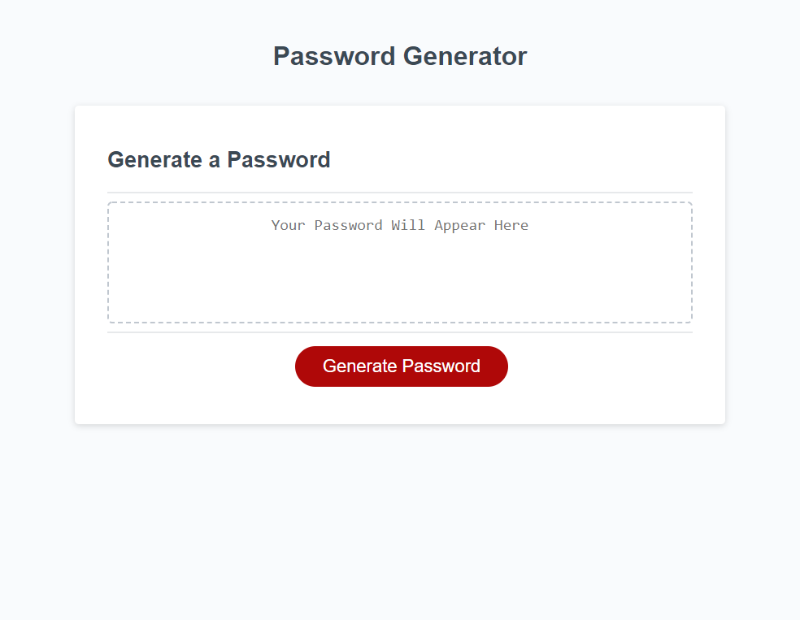

# 03 JavaScript: Password Generator

## Description

Create a **deployed** and **functional password generator** by writing JavaScript that queries the user for preferences and updates content on a pre-existing webpage.

### Motivation

As my first foray into writing JavaScript, this project presented many fun opportunities. It challenged me to consider both information flow and user experience, to research how computers generate random numbers, and to push myself beyond the bare-bones scope of the assignment to streamline long code (shoutout to ternary operators), and to achieve a flow that provdes a more intuitive experience for the user. 

### Learning Targets
This exercise encompassed building a JavaScript page inclusive of assigning variables and arrays, creating for loops and if/else statements, using ternary operators to concatenate arrays that matched user input, validating user input, and returning text to the screen.

## Core Objectives Met

1. Clicking the "Generate Password" button presents a series of prompts for password criteria.
2. Password criteria includes the length of the password (at least 8 characters and no more than 128 characters).
3. Password criteria includes character types to include - or - exclude from the password.
4. Character type options include lowercase, uppercase, numeric and special characters.
5. User input is validated for password length and a minimum of one character type selected.
6. A password is generated that matches the selected criteria.
7. The newly generated password is written to the page.

## Screen Shot

 

## Deployed Application

https://cailinbellwold.github.io/Password-Generator/
#
